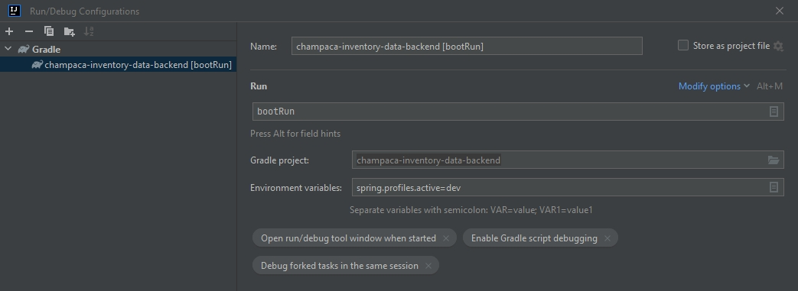

# champaca-inventory-data-backend
The backend service for inventory-data.champaca.com

# How to run with IntellJ
Set the config as in the image

# Docker
To build docker (and automatically deploy to Docker Desktop) use command `gradle dockerBuildImage`

## Docker Configuration
- port: 8080
- volumn: /app/reports
- environment 
- SPRING_PROFILES_ACTIVE options: dev prod

### More Explanation for each Spring profiles
- **dev** is for running app with `gradle bootRun`. 
  - when choosing `SPRING_PROFILES_ACTIVE=dev` make sure you have c:/reports created.
  - You can change the location from c:/reports to others by changing `champaca.reports.location` value in application-dev.properties
- **prod** is for Production
